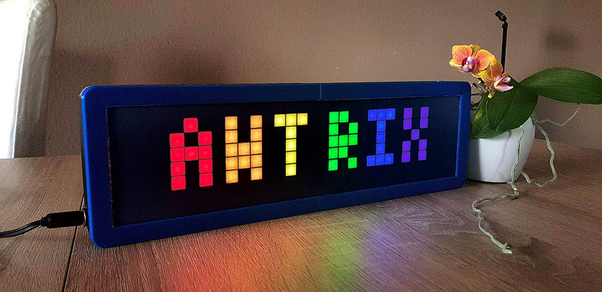

## Awtrix Simulator

[](https://actions-badge.atrox.dev/vincent0700/awtrix-simulator/goto)
[](https://github.com/Vincent0700/awtrix-simulator/commits/master)
[](https://github.com/vincent0700/awtrix-simulator/blob/master/LICENSE)

一个 LED 像素屏模拟器，用于模拟和连接 DIY 的仿 Awtrix 时钟。

[DEMO](https://vincent0700.github.io/awtrix-simulator)

### Features

- [x] Multi select
- [x] Draw pixels
- [ ] Gallery
  - [ ] Save & Load
- [ ] Undo & Redo
- [ ] Connect awtrix server

### Quick Start

```bash
# clone repos
$ git clone https://github.com/Vincent0700/awtrix-simulator.git

# install deps
$ npm i

# start dev server
$ npm run serve
```

### DO-IT-YOURSELF

- LED 全彩像素屏 (8x32)
- Awtirix 3D 打印外壳 + 格栅
- ESP8266 (CP2102)
- 杜邦线若干
- 手手 ✋

### Tutorial

待续 ...

### Links

[AWTIRX Documentation](https://awtrixdocs.blueforcer.de/#/en-en/README)


